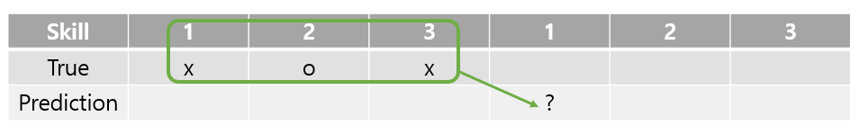
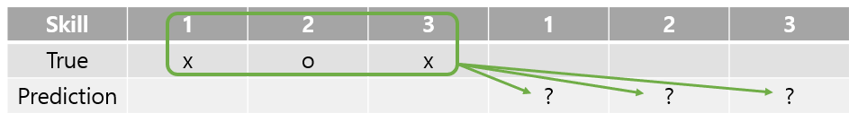
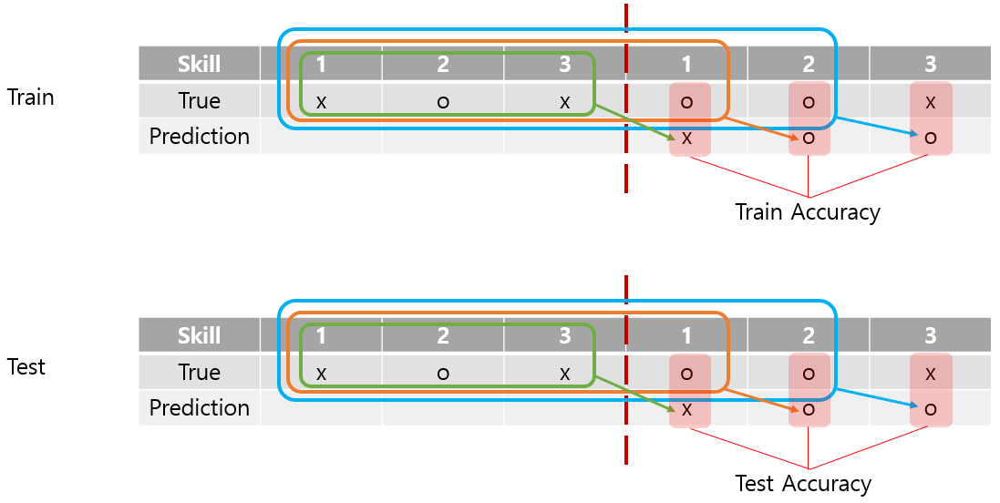
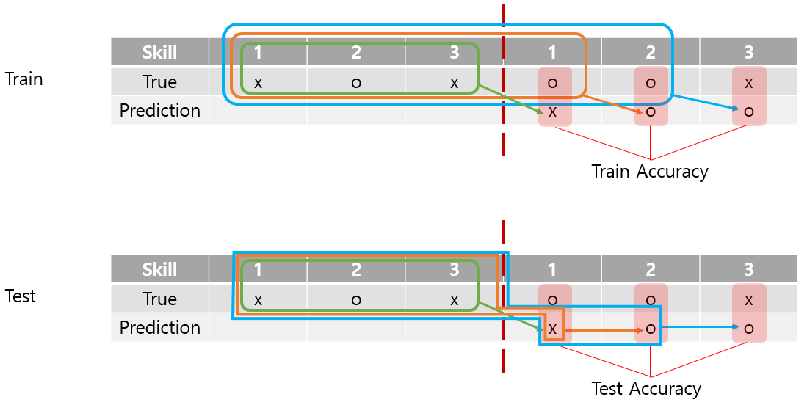
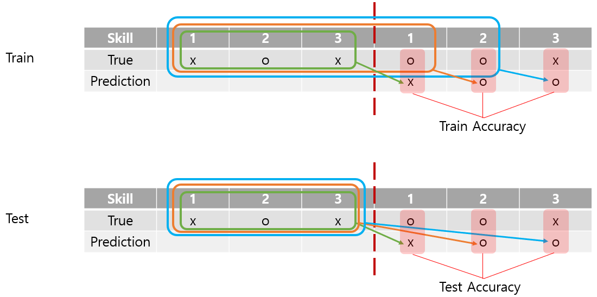

# Sequence2Sequence KT

- 학생의 현재 지식 수준 뿐 아니라 **미래의 지식 수준**을 예측

- **Knowlege Tracing** 
- **Sequence2Sequence Knowlege Tracing** 

## Model

- 기존 DKT 모델과 동일
  
## Dataset Description

- [Assistment2009 skill builder (updated)](https://github.com/jennyzhang0215/DKVMN/tree/master/data/assist2009_updated) 데이터 활용

### Data Format

- 첫 번째 row = the number of exercises
- 두 번째 row = skill id sequence (1 ~ num_skill)
- 세 번재 row = correct sequence (0 or 1)

  ``` csv
  15
  1,1,1,1,7,7,9,10,10,10,10,11,11,45,54
  0,1,1,1,1,1,0,0,1,1,1,1,1,0,0
  ```

### Data 통계

- 총 skill 개수 (*num_skill*) = 110
- 총 user 수 (*num_user*) = 4151
  - **전체 데이터 셋에서 풀이 시퀀스 7개 이상만 사용**
  - 풀이 시퀀스 7개 이상 = 3510
- train_data : (*num_user*) = 2291, (*max_length*) = 1235
  - 풀이 시퀀스 7개 이상 (*num_user*) = 1923
- valid data : (*num_user*) = 630, (*max_length*) = 1261
  - 풀이 시퀀스 7개 이상 (*num_user*) = 545
- test data : (*num_user*) = 1230, (*max_length*) = 1146
  - 풀이 시퀀스 7개 이상 (*num_user*) = 1042

## How To Run

1. Install reauirements

    ``` shell
    pip install -r requirements.txt
    ```

2. `main.py` 내 파라미터 조절

3. Train

      ``` shell
      python main.py --num_epochs 64 --no-emb-layer [--no-recurrent-test]
      ```

### Detail For Arguments

``` shell
optional arguments:
  --num_epochs NUM_EPOCHS
                        Maximum number of epochs to train the network
  --no-emb-layer        Do not use the embedding layer
  --no-recurrent-test   Do not test by recurrent way
  -lw1 LAMBDA_W1, --lambda_w1 LAMBDA_W1
                        The lambda coefficient for the regularization waviness
                        with l1-norm
  -lw2 LAMBDA_W2, --lambda_w2 LAMBDA_W2
                        The lambda coefficient for the regularization waviness
                        with l2-norm
  -lo LAMBDA_O, --lambda_o LAMBDA_O
                        The lambda coefficient for the regularization
                        objective
  --dataset DATASET     The dataset name
```

## Test Result

- 5번의 모델 학습 반복 및 평균 성능 기록

### Vanilla DKT

- Teacher forcing train, teacher forcing test 

  ```log
  test ACC for 5 runs : [0.7736427931068831, 0.7747584420759039, 0.7736228708038649, 0.7733041139555733, 0.7713716505628051]
  test AUC for 5 runs : [0.8230250705079691, 0.8250146544503408, 0.8227277757886046, 0.8243095051626629, 0.8233737455735537]

  average test ACC for 5 runs: 0.7733399741010062
  average test AUC for 5 runs: 0.8236901502966262
  ```

- Teacher forcing train, next prediction by sampling 

  ```log
  test ACC for 5 runs : [0.6714413786233688, 0.6752266161968323, 0.677716904074111, 0.6617192947504732, 0.671979280804861]
  test AUC for 5 runs : [0.638555515447901, 0.631095923976335, 0.6525283681389905, 0.6386572489386593, 0.6441125629028004]

  average test ACC for 5 runs: 0.6716166948899293
  average test AUC for 5 runs: 0.6409899238809371
  ```

- Teacher forcing train, no recurrent test 

  ```log
  test ACC for 5 runs : [0.6700866620181293, 0.6652654646877179, 0.6734734535312282, 0.6523358900288874, 0.6480924394860046]
  test AUC for 5 runs : [0.6630030617164477, 0.663168966240578, 0.6608234701298631, 0.6633056307552542, 0.6614543472739766]

  average test ACC for 5 runs: 0.6618507819503934
  average test AUC for 5 runs: 0.6623510952232239
  ```

## ToDo List

- [ ] Argmax pediction in test
  - 문제 풀이 확률의 argmax 값을 다음 지식 수준 측정할 때 사용
- [ ] Beam search inference in test
- [ ] No teacher forcing in train
  - Teacher forcing 비율을 train 하면서 조정
- [ ] Encoder-Decoder
  - Encoder와 Decoder 모델을 분리

## Apendix

This is forked fromm the repository of [DKT+](https://github.com/ckyeungac/deep-knowledge-tracing-plus).
